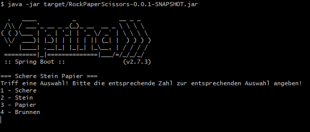

# Rock & Paper & Scissors

This is a coding kata project 

It's is a rock, paper, scissor and fountain game. Implemented via spring boot and played via the commandline

To build the project just run: 
```shell
 mvn clean install 
```

And to run the game: 
```shell
 java -jar target/RockPaperScissors-0.0.1-SNAPSHOT.jar
```

The starting screen should look like this: 

